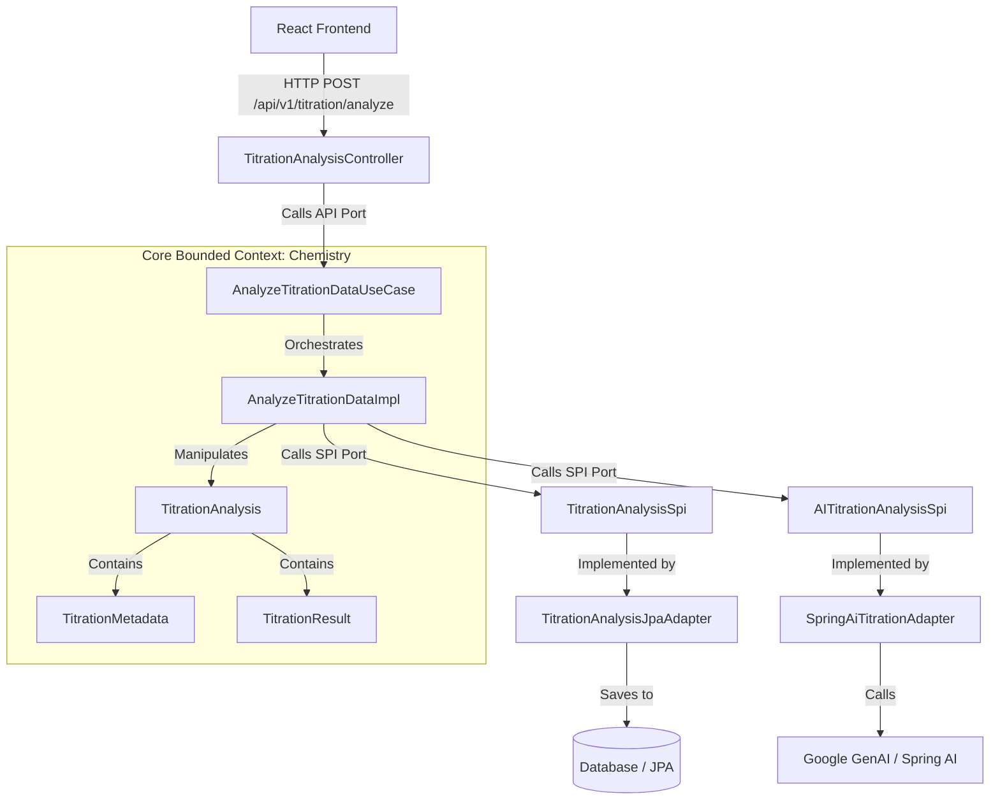

# 🧪 Titration Analysis Implementation Plan

This document outlines the architecture, backend structures, and frontend components to implement a basic **Acid-Base Titration Analysis** feature. 

The feature follows **Hexagonal Architecture (Ports & Adapters)** to decouple core chemistry domain logic from external concerns like REST controllers, databases, and AI models.

---

## 1. Architectural Overview

The application is structured into three layers:
1. **Core Domain & DTOs**: Models that represent titration entities, value objects, and data transfer objects.
2. **Ports (Inbound & Outbound)**: Interfaces defining how actors interact with the core (API) and how the core interacts with external services (SPI).
3. **Adapters**: Concrete implementations of controllers (inbound) and integrations with JPA databases or Spring AI (outbound).



---

## 2. Core Domain Structures

The domain classes are situated under `com.iona.laboraAI.chemistry.core.domain`. These classes represent the business logic of titration chemistry and should be free of any framework dependencies (such as Spring or JPA annotations).

### A. Aggregate Root: `TitrationAnalysis.java`
Represents a titration experiment analysis session.
```java
package com.iona.laboraAI.chemistry.core.domain;

import com.iona.laboraAI.system.common.domain.Experiment;
import com.iona.laboraAI.chemistry.core.domain.models.TitrationMetadata;
import com.iona.laboraAI.chemistry.core.domain.models.TitrationResult;
import lombok.AllArgsConstructor;
import lombok.Builder;
import lombok.Data;
import lombok.NoArgsConstructor;

@Data
@Builder
@NoArgsConstructor
@AllArgsConstructor
public class TitrationAnalysis {
    private String analysisId;
    private Experiment experiment;
    private TitrationMetadata titrationMetadata;
    private TitrationResult titrationResult;

    /**
     * Calculates titration metrics standard formulas.
     * M_acid * V_acid * Ratio_base = M_base * V_base * Ratio_acid
     */
    public void performCalculations() {
        if (titrationMetadata == null) return;
        
        // 1. Calculate Average Titre
        double avgTitre = titrationMetadata.getEndReading() - titrationMetadata.getStartReading();
        
        // 2. Calculate Concentration of Analyte
        // Formula assuming standard acid-base stoichiometry: Ca = (Cb * Vb * Ra) / (Va * Rb)
        double titrantConc = titrationMetadata.getConcentrationTitrant();
        double analyteVolume = titrationMetadata.getVolumeAnalyte();
        
        // Parse molar ratio (e.g. "1:1" -> ratio of Analyte:Titrant is 1:1)
        double analyteRatio = 1.0;
        double titrantRatio = 1.0;
        try {
            String[] parts = titrationMetadata.getMolarRatio().split(":");
            analyteRatio = Double.parseDouble(parts[0]);
            titrantRatio = Double.parseDouble(parts[1]);
        } catch (Exception e) {
            // Fallback to 1:1 if parsing fails
        }
        
        // Concentration = (Titrant Concentration * Titre Volume * Analyte Ratio) / (Analyte Volume * Titrant Ratio)
        double calculatedConc = (titrantConc * avgTitre * analyteRatio) / (analyteVolume * titrantRatio);
        
        // 3. Populate TitrationResult (placeholder for standard deviation and AI insight)
        this.titrationResult = new TitrationResult(
            calculatedConc,
            "M",
            avgTitre,
            0.0, // Calculated dynamically if multiple readings are provided
            false, // pH data presence checked dynamically
            "" // Populated via external AI service later
        );
    }
}
```

### B. Metadata: `TitrationMetadata.java`
Encapsulates all input data provided by the user.
```java
package com.iona.laboraAI.chemistry.core.domain.models;

import lombok.Value;

@Value
public class TitrationMetadata {
    Double burretteVolume;       // Max burette capacity (e.g., 50.0 mL)
    Double startReading;         // Initial volume (e.g., 0.0 mL)
    Double endReading;           // Final volume at endpoint (e.g., 24.5 mL)
    Double concentrationTitrant; // Molarity of known solution (e.g., 0.1 M)
    String titrantName;          // e.g., "HCl"
    String analyteName;          // e.g., "NaOH"
    String molarRatio;           // e.g., "1:1"
    Double volumeAnalyte;        // Volume of unknown solution pipetted (e.g., 25.0 mL)
}
```

### C. Result: `TitrationResult.java`
Represents the numerical calculations and qualitative AI feedback.
```java
package com.iona.laboraAI.chemistry.core.domain.models;

import lombok.Value;

@Value
public class TitrationResult {
    Double concentration;             // Calculated molarity of analyte
    String unit;                      // e.g., "M" (Molarity)
    Double averageTitre;              // Volume of titrant used (endReading - startReading)
    Double standardDeviation;         // Accuracy measurement over trials
    Boolean phAvailable;              // Whether pH curve readings were submitted
    String equivalencePointInsight;   // Detailed qualitative review generated by AI
}
```

---

## 3. Ports (Contracts)

Located in `com.iona.laboraAI.chemistry.core.ports`. Ports define the inputs/outputs of our core logic.

### A. Inbound Port (API): `AnalyzeTitrationDataUseCase.java`
Defines what the REST Controller calls.
```java
package com.iona.laboraAI.chemistry.core.ports.api;

import com.iona.laboraAI.chemistry.core.dtos.requests.TitrationAnalysisRequest;
import com.iona.laboraAI.chemistry.core.dtos.response.TitrationAnalysisResponse;

public interface AnalyzeTitrationDataUseCase {
    TitrationAnalysisResponse analyze(TitrationAnalysisRequest request);
}
```

### B. Outbound Port (SPI - Persistence): `TitrationAnalysisSpi.java`
Defines how to persist results. We refactor the default `void performTitrationAnalysis()` interface to accept and return domain models.
```java
package com.iona.laboraAI.chemistry.core.ports.spi;

import com.iona.laboraAI.chemistry.core.domain.TitrationAnalysis;

public interface TitrationAnalysisSpi {
    TitrationAnalysis save(TitrationAnalysis titrationAnalysis);
}
```

### C. Outbound Port (SPI - AI Service): `AITitrationAnalysisSpi.java`
Defines how to call the AI service. We refine this interface to accept the titration analysis and return qualitative insights.
```java
package com.iona.laboraAI.chemistry.core.ports.spi;

import com.iona.laboraAI.chemistry.core.domain.models.TitrationMetadata;

public interface AITitrationAnalysisSpi {
    /**
     * Asks AI to generate insights about equivalence points, expected pH curve,
     * choice of indicator, and experimental error analysis.
     */
    String generateInsight(TitrationMetadata metadata, Double averageTitre, Double calculatedConcentration);
}
```

---

## 4. Core Application Service (Orchestrator)

Located in `com.iona.laboraAI.chemistry.application.services`. This implements our inbound port and calls outbound SPIs.

### `AnalyzeTitrationDataImpl.java`
```java
package com.iona.laboraAI.chemistry.application.services;

import com.iona.laboraAI.chemistry.core.domain.TitrationAnalysis;
import com.iona.laboraAI.chemistry.core.domain.models.TitrationMetadata;
import com.iona.laboraAI.chemistry.core.domain.models.TitrationResult;
import com.iona.laboraAI.chemistry.core.dtos.requests.TitrationAnalysisRequest;
import com.iona.laboraAI.chemistry.core.dtos.response.TitrationAnalysisResponse;
import com.iona.laboraAI.chemistry.core.ports.api.AnalyzeTitrationDataUseCase;
import com.iona.laboraAI.chemistry.core.ports.spi.AITitrationAnalysisSpi;
import com.iona.laboraAI.chemistry.core.ports.spi.TitrationAnalysisSpi;
import com.iona.laboraAI.system.common.domain.Experiment;
import com.iona.laboraAI.system.utils.Status;
import lombok.RequiredArgsConstructor;
import org.springframework.stereotype.Service;

import java.util.UUID;

@Service
@RequiredArgsConstructor
public class AnalyzeTitrationDataImpl implements AnalyzeTitrationDataUseCase {

    private final TitrationAnalysisSpi persistenceSpi;
    private final AITitrationAnalysisSpi aiSpi;

    @Override
    public TitrationAnalysisResponse analyze(TitrationAnalysisRequest request) {
        // 1. Map DTO to Domain Metadata
        // Take first reading if multiple readings are provided, or average them.
        Double startRead = 0.0;
        Double endRead = 0.0;
        if (request.getReadings() != null && !request.getReadings().isEmpty()) {
            startRead = 0.0;
            // Calculate average final reading across trials
            endRead = request.getReadings().stream()
                    .mapToDouble(r -> r.getVolume() != null ? r.getVolume() : 0.0)
                    .average()
                    .orElse(25.0);
        }

        TitrationMetadata metadata = new TitrationMetadata(
                request.getBurretteVolume() != null ? request.getBurretteVolume() : 50.0,
                startRead,
                endRead,
                request.getConcentrationTitrant() != null ? request.getConcentrationTitrant() : 0.1,
                request.getTitrantName() != null ? request.getTitrantName() : "HCl",
                request.getAnalyteName() != null ? request.getAnalyteName() : "NaOH",
                request.getMolarRatio() != null ? request.getMolarRatio() : "1:1",
                request.getVolumeAnalyte() != null ? request.getVolumeAnalyte() : 25.0
        );

        // 2. Instantiate Domain Entity and perform mathematical calculations
        TitrationAnalysis domainAnalysis = TitrationAnalysis.builder()
                .analysisId(UUID.randomUUID().toString())
                .experiment(new Experiment()) // Map fields from request if needed
                .titrationMetadata(metadata)
                .build();

        domainAnalysis.performCalculations();
        TitrationResult calculations = domainAnalysis.getTitrationResult();

        // 3. Query Outbound AI Service for scientific interpretation
        String aiInsight = aiSpi.generateInsight(
                metadata,
                calculations.getAverageTitre(),
                calculations.getConcentration()
        );

        // 4. Update Domain Entity with AI Insights
        TitrationResult finalResult = new TitrationResult(
                calculations.getConcentration(),
                calculations.getUnit(),
                calculations.getAverageTitre(),
                calculations.getStandardDeviation(),
                request.getReadings().stream().anyMatch(r -> r.getPH() != null),
                aiInsight
        );
        domainAnalysis.setTitrationResult(finalResult);

        // 5. Save entity via Persistence Adapter
        persistenceSpi.save(domainAnalysis);

        // 6. Return Response DTO
        return TitrationAnalysisResponse.builder()
                .experimentId(domainAnalysis.getAnalysisId())
                .calculatedConcentration(finalResult.getConcentration())
                .concentrationUnit(finalResult.getUnit())
                .averageTitre(finalResult.getAverageTitre())
                .standardDeviation(finalResult.getStandardDeviation())
                .phDataAvailable(finalResult.getPhAvailable())
                .equivalencePointInsight(finalResult.getEquivalencePointInsight())
                .expInsight("Titration calculations verified. AI chemical analysis attached.")
                .modelUsed("gemini-1.5-flash")
                .status(Status.SUCCESS)
                .build();
    }
}
```

---

## 5. Adapters (External Services)

Situated under `com.iona.laboraAI.chemistry.adapters`.

### A. Inbound Adapter: `TitrationAnalysisController.java` (REST API)
Handles HTTP request routing. Maps to `/api/v1/titration/analyze`.
```java
package com.iona.laboraAI.chemistry.adapters.rest;

import com.iona.laboraAI.chemistry.core.dtos.requests.TitrationAnalysisRequest;
import com.iona.laboraAI.chemistry.core.dtos.response.TitrationAnalysisResponse;
import com.iona.laboraAI.chemistry.core.ports.api.AnalyzeTitrationDataUseCase;
import lombok.RequiredArgsConstructor;
import org.springframework.http.ResponseEntity;
import org.springframework.web.bind.annotation.*;

@CrossOrigin(origins = "*")
@RestController
@RequestMapping("/api/v1/titration")
@RequiredArgsConstructor
public class TitrationAnalysisController {

    private final AnalyzeTitrationDataUseCase analyzeUsecase;

    @PostMapping("/analyze")
    public ResponseEntity<TitrationAnalysisResponse> analyze(@RequestBody TitrationAnalysisRequest request) {
        TitrationAnalysisResponse response = analyzeUsecase.analyze(request);
        return ResponseEntity.ok(response);
    }
}
```

### B. Outbound Adapter: `SpringAiTitrationAdapter.java` (Spring AI integration)
Uses Spring AI's `ChatClient` to trigger the Gemini Model.
```java
package com.iona.laboraAI.chemistry.adapters.ai;

import com.iona.laboraAI.chemistry.core.domain.models.TitrationMetadata;
import com.iona.laboraAI.chemistry.core.ports.spi.AITitrationAnalysisSpi;
import lombok.RequiredArgsConstructor;
import org.springframework.ai.chat.client.ChatClient;
import org.springframework.stereotype.Component;

@Component
@RequiredArgsConstructor
public class SpringAiTitrationAdapter implements AITitrationAnalysisSpi {

    private final ChatClient.Builder chatClientBuilder;

    @Override
    public String generateInsight(TitrationMetadata metadata, Double averageTitre, Double calculatedConcentration) {
        ChatClient chatClient = chatClientBuilder.build();

        // 1. Build System Instruction for structured, high-quality chemistry outputs
        String systemInstruction = """
            You are a Chemistry Lab AI assistant. You analyze acid-base titration experiments.
            Provide details in Markdown format:
            - A brief summary of the reaction mechanism and balanced chemical equation.
            - Evaluation of the calculations (Titre: {averageTitre} mL, Analyte Molarity: {calculatedConcentration} M).
            - An explanation of the expected pH curve progression (initial pH, buffering, equivalence point pH, and excess titrant plateau).
            - Suggestion on the best indicator for this titration (e.g. Phenolphthalein, Methyl Orange, Bromothymol Blue) with justification based on the pKa of the indicator and pH at equivalence point.
            - Common sources of error in this specific titration.
            """;

        // 2. Build User Prompt from Titration Metadata
        String userPrompt = String.format("""
            Titration details:
            - Titrant (solution in burette): %s
            - Concentration of Titrant: %.4f M
            - Analyte (solution in flask): %s
            - Volume of Analyte: %.2f mL
            - Stoichiometric Molar Ratio (Analyte:Titrant): %s
            - Average Titre added: %.2f mL
            - Calculated Concentration of Analyte: %.4f M
            
            Please provide a comprehensive analytical report. Keep it clear, scientific, and educational.
            """,
            metadata.getTitrantName(),
            metadata.getConcentrationTitrant(),
            metadata.getAnalyteName(),
            metadata.getVolumeAnalyte(),
            metadata.getMolarRatio(),
            averageTitre,
            calculatedConcentration
        );

        try {
            return chatClient.prompt()
                    .system(systemInstruction)
                    .user(userPrompt)
                    .call()
                    .content();
        } catch (Exception e) {
            return "AI analysis unavailable: " + e.getMessage() + ". Raw calculations: " + 
                   String.format("Calculated %s concentration is %.4f M using %.2f mL of %s.", 
                           metadata.getAnalyteName(), calculatedConcentration, averageTitre, metadata.getTitrantName());
        }
    }
}
```

### C. Outbound Adapter: `TitrationAnalysisJpaAdapter.java` (Database Access)
Implements `TitrationAnalysisSpi` by forwarding domain requests to a Spring Data JpaRepository.
```java
package com.iona.laboraAI.chemistry.adapters.persistence;

import com.iona.laboraAI.chemistry.core.domain.TitrationAnalysis;
import com.iona.laboraAI.chemistry.core.ports.spi.TitrationAnalysisSpi;
import org.springframework.stereotype.Component;

@Component
public class TitrationAnalysisJpaAdapter implements TitrationAnalysisSpi {

    // Inject your JPA entities and repository here:
    // private final TitrationAnalysisRepository repository;

    @Override
    public TitrationAnalysis save(TitrationAnalysis titrationAnalysis) {
        // Map domain 'TitrationAnalysis' model into a JPA Database Entity and save.
        // For simple setups, this can write into a mock log or JSON cache until fully migrated.
        System.out.println("Saving Titration Analysis to DB: " + titrationAnalysis.getAnalysisId());
        return titrationAnalysis;
    }
}
```

---

## 6. Frontend UI (React + TypeScript)

The UI will be hosted at `/app` or a `/titration` route, styled with the premium dark theme matching the landing page.

### A. Titration Analysis Component (`TitrationApp.tsx`)
```tsx
import React, { useState } from 'react';

interface Reading {
  volume: number;
  pH?: number;
}

interface AnalysisResponse {
  experimentId: string;
  calculatedConcentration: number;
  concentrationUnit: string;
  averageTitre: number;
  phDataAvailable: boolean;
  equivalencePointInsight: string;
  expInsight: string;
  modelUsed: string;
}

export const TitrationApp: React.FC = () => {
  const [titrantName, setTitrantName] = useState('HCl');
  const [analyteName, setAnalyteName] = useState('NaOH');
  const [concentrationTitrant, setConcentrationTitrant] = useState(0.1);
  const [volumeAnalyte, setVolumeAnalyte] = useState(25.0);
  const [molarRatio, setMolarRatio] = useState('1:1');
  const [buretteVolume, setBuretteVolume] = useState(50.0);
  
  // Trial readings list
  const [readings, setReadings] = useState<Reading[]>([{ volume: 24.5 }]);
  
  const [loading, setLoading] = useState(false);
  const [response, setResponse] = useState<AnalysisResponse | null>(null);
  const [error, setError] = useState('');

  const addReading = () => {
    setReadings([...readings, { volume: 0 }]);
  };

  const updateReading = (index: number, val: number) => {
    const updated = [...readings];
    updated[index].volume = val;
    setReadings(updated);
  };

  const removeReading = (index: number) => {
    if (readings.length > 1) {
      setReadings(readings.filter((_, i) => i !== index));
    }
  };

  const handleSubmit = async (e: React.FormEvent) => {
    e.preventDefault();
    setLoading(true);
    setError('');
    setResponse(null);

    const payload = {
      titrantName,
      analyteName,
      concentrationTitrant,
      volumeAnalyte,
      molarRatio,
      burretteVolume,
      readings
    };

    try {
      const res = await fetch('http://localhost:8080/api/v1/titration/analyze', {
        method: 'POST',
        headers: {
          'Content-Type': 'application/json',
        },
        body: JSON.stringify(payload),
      });

      if (!res.ok) {
        throw new Error(`Server returned error: ${res.statusText}`);
      }

      const data: AnalysisResponse = await res.json();
      setResponse(data);
    } catch (err: any) {
      setError(err.message || 'An error occurred while submitting titration data.');
    } finally {
      setLoading(false);
    }
  };

  return (
    <div className="min-h-screen bg-bg text-white font-body p-6 flex flex-col items-center">
      {/* Background Radial Glow */}
      <div className="absolute top-[20%] w-[50vw] h-[50vw] rounded-full bg-[radial-gradient(circle,rgba(0,220,160,0.04)_0%,rgba(0,220,160,0)_60%)] blur-[100px] pointer-events-none" />

      <div className="w-full max-w-5xl z-10">
        <h1 className="font-heading text-3xl font-bold tracking-tight mb-2 bg-gradient-to-r from-accent to-secondary bg-clip-text text-transparent">
          🧪 Acid-Base Titration Analyzer
        </h1>
        <p className="text-gray-400 mb-8 text-sm">
          Enter experimental readings and parameters to compute concentrations and generate AI-driven chemical insights.
        </p>

        <div className="grid grid-cols-1 lg:grid-cols-12 gap-8">
          
          {/* Form Side */}
          <form onSubmit={handleSubmit} className="lg:col-span-5 bg-surface border border-white/5 p-6 rounded-2xl shadow-xl flex flex-col gap-5">
            <h2 className="font-heading text-lg font-semibold border-b border-white/5 pb-2 mb-1 text-white/90">
              Titration Parameters
            </h2>

            {/* Chemicals */}
            <div className="grid grid-cols-2 gap-4">
              <div>
                <label className="block text-xs font-semibold text-gray-400 mb-1">TITRANT (Burette)</label>
                <input
                  type="text"
                  value={titrantName}
                  onChange={(e) => setTitrantName(e.target.value)}
                  className="w-full bg-white/5 border border-white/10 rounded-lg p-2 text-sm focus:border-accent outline-none transition"
                  placeholder="e.g. HCl"
                  required
                />
              </div>
              <div>
                <label className="block text-xs font-semibold text-gray-400 mb-1">ANALYTE (Flask)</label>
                <input
                  type="text"
                  value={analyteName}
                  onChange={(e) => setAnalyteName(e.target.value)}
                  className="w-full bg-white/5 border border-white/10 rounded-lg p-2 text-sm focus:border-accent outline-none transition"
                  placeholder="e.g. NaOH"
                  required
                />
              </div>
            </div>

            {/* Strengths & stoichiometry */}
            <div className="grid grid-cols-2 gap-4">
              <div>
                <label className="block text-xs font-semibold text-gray-400 mb-1">TITRANT CONC. (M)</label>
                <input
                  type="number"
                  step="0.0001"
                  value={concentrationTitrant}
                  onChange={(e) => setConcentrationTitrant(parseFloat(e.target.value))}
                  className="w-full bg-white/5 border border-white/10 rounded-lg p-2 text-sm focus:border-accent outline-none transition"
                  required
                />
              </div>
              <div>
                <label className="block text-xs font-semibold text-gray-400 mb-1">ANALYTE VOL. (mL)</label>
                <input
                  type="number"
                  step="0.1"
                  value={volumeAnalyte}
                  onChange={(e) => setVolumeAnalyte(parseFloat(e.target.value))}
                  className="w-full bg-white/5 border border-white/10 rounded-lg p-2 text-sm focus:border-accent outline-none transition"
                  required
                />
              </div>
            </div>

            <div className="grid grid-cols-2 gap-4">
              <div>
                <label className="block text-xs font-semibold text-gray-400 mb-1">MOLAR RATIO (A:T)</label>
                <input
                  type="text"
                  value={molarRatio}
                  onChange={(e) => setMolarRatio(e.target.value)}
                  className="w-full bg-white/5 border border-white/10 rounded-lg p-2 text-sm focus:border-accent outline-none transition"
                  placeholder="e.g. 1:1"
                  required
                />
              </div>
              <div>
                <label className="block text-xs font-semibold text-gray-400 mb-1">BURETTE SIZE (mL)</label>
                <input
                  type="number"
                  value={buretteVolume}
                  onChange={(e) => setBuretteVolume(parseFloat(e.target.value))}
                  className="w-full bg-white/5 border border-white/10 rounded-lg p-2 text-sm focus:border-accent outline-none transition"
                  required
                />
              </div>
            </div>

            {/* Trial Readings */}
            <div className="mt-2">
              <div className="flex justify-between items-center mb-2 border-b border-white/5 pb-2">
                <label className="block text-xs font-semibold text-gray-400">TRIAL TITRE READINGS (mL)</label>
                <button
                  type="button"
                  onClick={addReading}
                  className="text-xs font-medium text-accent hover:text-accent/80 transition"
                >
                  + Add Trial
                </button>
              </div>
              
              <div className="flex flex-col gap-2 max-h-[140px] overflow-y-auto pr-1">
                {readings.map((reading, idx) => (
                  <div key={idx} className="flex gap-2 items-center">
                    <span className="text-xs text-gray-400 w-16">Trial {idx + 1}:</span>
                    <input
                      type="number"
                      step="0.01"
                      value={reading.volume}
                      onChange={(e) => updateReading(idx, parseFloat(e.target.value))}
                      className="flex-1 bg-white/5 border border-white/10 rounded-lg p-2 text-sm focus:border-accent outline-none transition"
                      placeholder="Final volume in mL"
                      required
                    />
                    {readings.length > 1 && (
                      <button
                        type="button"
                        onClick={() => removeReading(idx)}
                        className="text-red-400 hover:text-red-300 text-xs px-2"
                      >
                        ✕
                      </button>
                    )}
                  </div>
                ))}
              </div>
            </div>

            <button
              type="submit"
              disabled={loading}
              className="w-full bg-accent hover:bg-accent/90 text-bg font-semibold py-2.5 px-4 rounded-lg text-sm transition mt-2 cursor-pointer disabled:opacity-50"
            >
              {loading ? 'Analyzing Titration...' : 'Submit to AI Analyzer'}
            </button>
          </form>

          {/* Results Side */}
          <div className="lg:col-span-7 flex flex-col gap-6">
            
            {/* Status & Loading states */}
            {loading && (
              <div className="bg-surface border border-white/5 p-12 rounded-2xl flex flex-col items-center justify-center flex-1">
                <div className="animate-spin rounded-full h-8 w-8 border-b-2 border-accent mb-4" />
                <p className="text-sm text-gray-400">Performing math calculations & awaiting AI chemical review...</p>
              </div>
            )}

            {!loading && !response && !error && (
              <div className="bg-surface border border-white/5 p-12 rounded-2xl flex flex-col items-center justify-center text-center flex-1">
                <div className="text-gray-500 text-4xl mb-4">🧪</div>
                <p className="text-sm text-gray-400">Fill in the parameters on the left and submit to view analysis.</p>
              </div>
            )}

            {error && (
              <div className="bg-red-500/10 border border-red-500/20 p-4 rounded-xl text-red-300 text-sm">
                <strong>Error: </strong> {error}
              </div>
            )}

            {/* Calculations and AI details */}
            {response && (
              <div className="flex flex-col gap-6 flex-1">
                
                {/* Math Card */}
                <div className="bg-surface border border-white/5 p-6 rounded-2xl grid grid-cols-2 gap-4">
                  <div className="flex flex-col">
                    <span className="text-xs text-gray-400 font-semibold mb-1">CALCULATED CONCENTRATION</span>
                    <span className="text-2xl font-bold text-accent font-mono">
                      {response.calculatedConcentration.toFixed(4)} {response.concentrationUnit}
                    </span>
                  </div>
                  <div className="flex flex-col">
                    <span className="text-xs text-gray-400 font-semibold mb-1">AVERAGE TITRE VALUE</span>
                    <span className="text-2xl font-bold text-secondary font-mono">
                      {response.averageTitre.toFixed(2)} mL
                    </span>
                  </div>
                </div>

                {/* AI Markdown Insight */}
                <div className="bg-surface border border-white/5 p-6 rounded-2xl flex-1">
                  <div className="flex justify-between items-center mb-4 border-b border-white/5 pb-2">
                    <h3 className="font-heading font-semibold text-white/90">
                      AI Chemical Review
                    </h3>
                    <span className="text-xs px-2 py-0.5 rounded bg-white/5 border border-white/10 text-gray-400 font-mono">
                      {response.modelUsed}
                    </span>
                  </div>
                  
                  {/* Styled Scrollable Markdown Box */}
                  <div className="text-sm text-gray-300 leading-relaxed font-body whitespace-pre-wrap max-h-[400px] overflow-y-auto pr-2">
                    {response.equivalencePointInsight}
                  </div>
                </div>

              </div>
            )}
          </div>

        </div>
      </div>
    </div>
  );
};
```

---

## 7. Recommended Implementation Sequence

To construct this system systematically, implement the files in the following order:

1. **Refactor/Write Domain Value Objects** (`TitrationMetadata.java`, `TitrationResult.java`).
2. **Refactor Ports** (`AnalyzeTitrationDataUseCase.java`, `TitrationAnalysisSpi.java`, `AITitrationAnalysisSpi.java`).
3. **Write Use Case Orchestrator** (`AnalyzeTitrationDataImpl.java`).
4. **Implement Adapters**:
   - `SpringAiTitrationAdapter.java` (using your Spring AI `ChatClient` builder).
   - `TitrationAnalysisJpaAdapter.java` (mapping domain to persistence layer).
   - `TitrationAnalysisController.java` (defining endpoints).
5. **Implement UI component** (`TitrationApp.tsx`) and wire it up to the `/app` route in `App.tsx`.
